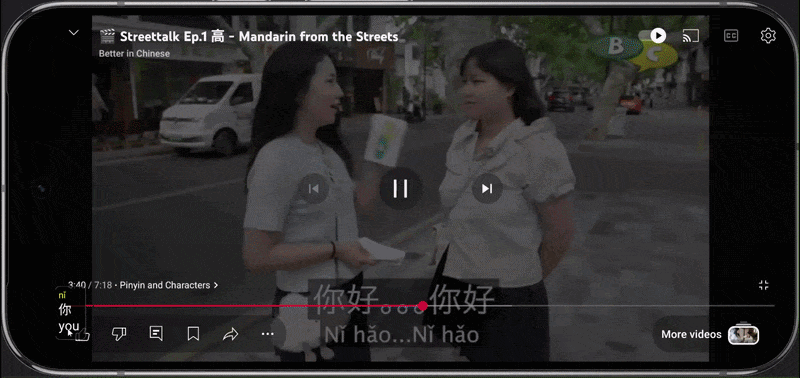
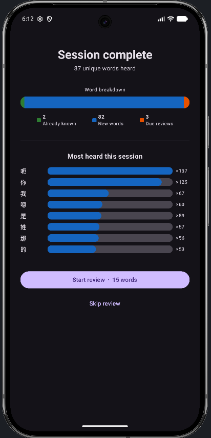
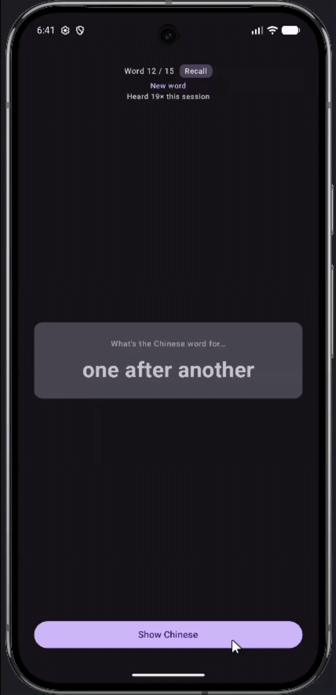
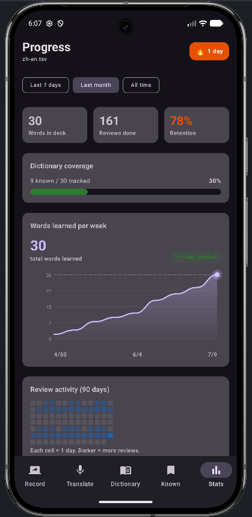
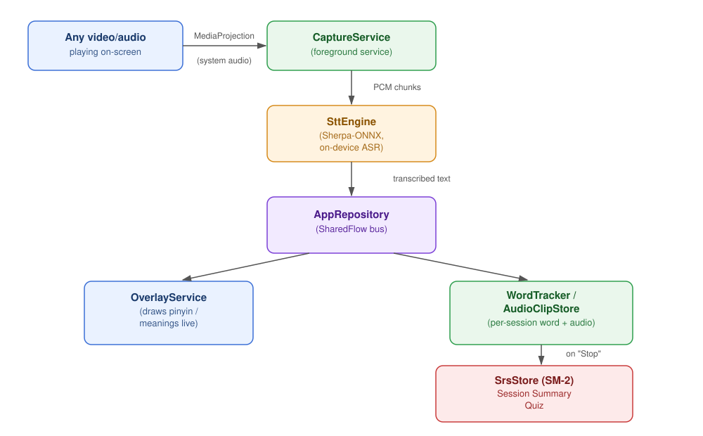

# SubtitleLearn

**Turn any on-screen video or audio into a live, interactive Chinese vocabulary lesson.**

SubtitleLearn uses on-device speech recognition to transcribe whatever's playing on your phone in real time, overlays pinyin and meanings directly on top of the video, tracks every word you hear, and quizzes you later on the ones you're most likely to forget. It's powered by a spaced-repetition engine built from scratch.

Point it at a show, a podcast, a YouTube video, or anything with audio. No manual lookup, no pre-made decks. Your vocabulary list builds itself from what you actually watch.

<p align="center">
  
</p>

<p align="center">
  
  
</p>

<p align="center">
  
</p>

---

## Table of contents

- [Why I built this](#why-i-built-this)
- [Features](#features)
- [How it works](#how-it-works)
- [Tech stack](#tech-stack)
- [Screens](#screens)
- [Dictionary data](#dictionary-data)
- [Running it locally](#running-it-locally)
- [Known limitations](#known-limitations)
- [What I'd build next](#what-id-build-next)

---

## Why I built this

Most subtitle and language-learning tools are either static (pre-made flashcard decks with no connection to what you're actually watching) or require manual lookup for every unfamiliar word. I wanted something that passively picks up vocabulary from media I'm already consuming and turns that into a personalized review queue, without any manual data entry.

## Features

| | |
|---|---|
| **Live on-screen overlay** | Transcribes system audio in real time via `MediaProjection` and on-device ASR, then renders pinyin, characters, and per-character breakdowns directly over the video. Hand-drawn on `Canvas` for full layout control. |
| **Spaced repetition (SM-2)** | Every word you hear gets a review card. Correct recalls push the next review further out; failures reset the interval. Classic Anki-style algorithm, implemented from scratch. |
| **Session summaries** | After each capture session, you get a breakdown of new vs. already-known vs. due-for-review words, plus your most-heard words, before moving into review. |
| **Two-directional quizzing** | Recognition (see Chinese, recall the meaning) and production (see the meaning, recall the Chinese), randomly assigned per card so you're not just pattern-matching characters. |
| **Per-word audio clips** | The first time you hear a new word, its audio is clipped from the live stream (silence trimmed via energy-based VAD) and saved for playback during review. |
| **Known-word suppression** | Words you've mastered stop cluttering the overlay with meanings you no longer need. |
| **Custom & swappable dictionaries** | Switch between bundled dictionary files, or add your own words and meanings, fully persisted across restarts. |
| **Progress dashboard** | Streaks, retention rate, a GitHub-style review heatmap, and a cumulative words-learned chart. |
| **Standalone mic mode** | A manual "type or speak" translate screen for on-the-fly lookups, separate from the screen-capture pipeline. |

## How it works

<p align="center">
  
</p>

Speech recognition runs fully on-device via [Sherpa-ONNX](https://github.com/k2-fsa/sherpa-onnx) (streaming Paraformer model, INT8-quantized). No audio ever leaves the phone.

## Tech stack

- **UI**: Kotlin + Jetpack Compose (Material 3)
- **Concurrency**: Coroutines and Flow for the capture-to-transcription-to-overlay pipeline
- **Audio capture**: `MediaProjection` API for system audio, `AudioRecord` for mic input
- **ASR**: [Sherpa-ONNX](https://github.com/k2-fsa/sherpa-onnx) streaming Paraformer, CPU, INT8-quantized, fully on-device
- **Overlay rendering**: Custom Canvas-based view via `WindowManager` and `TYPE_APPLICATION_OVERLAY`
- **Spaced repetition**: SM-2 algorithm, implemented from scratch
- **Persistence**: SharedPreferences + JSON (SRS state, review history, custom dictionary entries)
- **Backend**: None. 100% local, no network calls, no accounts

## Screens

| Record | Translate | Dictionary |
|---|---|---|
| Start/stop capture with a live pulsing record button | Manual mic or typed lookup with word-by-word breakdown | Browse, search, and add custom entries |

| Known Words | Stats | Quiz |
|---|---|---|
| Review history with status/grade filters | Streaks, retention, heatmap, learning curve | Recognition/production flashcards with audio replay |

## Dictionary data

The bundled Chinese dictionary is built by merging:

- [CedPane](https://github.com/ssb22/CedPane) (`PD-English-Definitions.tsv`) for public-domain English definitions
- [CC-CEDICT](https://cc-cedict.org/) for pinyin readings
- [pypinyin](https://github.com/mozillazg/python-pinyin) as a fallback for generating pinyin on entries missing from CC-CEDICT

> CC-CEDICT is licensed CC BY-SA 4.0. Check their site for full attribution terms before redistributing any dictionary file derived from it.

### Extending to other languages

A few sources worth looking at if you want to build dictionaries for other languages:

- [WikDict SQLite dumps](https://download.wikdict.com/dictionaries/sqlite/2/)
- [Kaikki (Wiktionary extracts as structured data)](https://kaikki.org/dictionary/rawdata.html)
- [open-dsl-dict / wiktionary-dict](https://github.com/open-dsl-dict/wiktionary-dict/tree/master)

## Running it locally

```bash
git clone https://github.com//SubtitleLearn.git
cd SubtitleLearn
```

### 1. Download the ASR model files (not included in this repo)

The Sherpa-ONNX model files are about 150MB combined, over GitHub's file size limit, so they're excluded via `.gitignore` and downloaded separately.

Download the bilingual streaming Paraformer model:

```bash
curl -LO https://github.com/k2-fsa/sherpa-onnx/releases/download/asr-models/sherpa-onnx-streaming-paraformer-bilingual-zh-en.tar.bz2
tar -xjf sherpa-onnx-streaming-paraformer-bilingual-zh-en.tar.bz2
```

Then copy the three required files into the assets folder:

```bash
cp sherpa-onnx-streaming-paraformer-bilingual-zh-en/encoder.int8.onnx  app/src/main/assets/model/
cp sherpa-onnx-streaming-paraformer-bilingual-zh-en/decoder.int8.onnx  app/src/main/assets/model/
cp sherpa-onnx-streaming-paraformer-bilingual-zh-en/tokens.txt         app/src/main/assets/model/
```

Your `assets/model/` folder should end up looking like this:
app/src/main/assets/model/
├── encoder.int8.onnx
├── decoder.int8.onnx
└── tokens.txt

Further reading:
- [Sherpa-ONNX Android docs](https://k2-fsa.github.io/sherpa/onnx/android/index.html)
- [Sherpa-ONNX releases (native libs)](https://github.com/k2-fsa/sherpa-onnx/releases/)

### 2. Build and run

1. Open the project in Android Studio (Koala or newer recommended).
2. Build and run on a device or emulator running Android 10+ (API 29+, required for `MediaProjection` screen-audio capture).
3. On first launch, grant the overlay and microphone permissions when prompted.

## Known limitations

- Dictionary segmentation currently assumes Chinese (character-based greedy matching) and isn't yet generalized to space-delimited languages.
- ASR accuracy depends on audio clarity. Background music or sound effects mixed with speech will degrade transcription quality.
- Tested primarily on an emulator, not yet validated across a wide range of OEMs or Android versions.

## What I'd build next

- HSK-frequency-based overlay filtering (suppress ultra-common words like 的/了/是 by default)
- Export/import for SRS decks
- Support for additional source languages

---

*Built as a personal project to combine on-device ML, custom Compose/Canvas UI, and applied spaced-repetition theory in one app.*